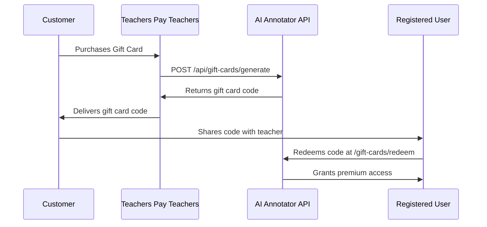

# Teachers Pay Teachers Gift Card Integration

This document outlines how to integrate the AI Lesson Plan Annotator gift card system with Teachers Pay Teachers marketplace.

## Overview

The gift card system allows Teachers Pay Teachers to sell premium access gift cards that customers can redeem for one month of premium service on the AI Lesson Plan Annotator platform.

## Integration Flow



## API Endpoints

### Generate Gift Card (Teachers Pay Teachers → AI Annotator)

**Endpoint:** `POST /api/gift-cards/generate`

**Headers:**
```
Content-Type: application/json
API-Key: [TPT_API_KEY]
```

**Request Body:**
```json
{
    "purchase_id": "TPT-ORDER-12345",
    "purchase_email": "customer@email.com",
    "value_months": 1,
    "expires_days": 365,
    "notes": "Teachers Pay Teachers purchase"
}
```

**Response (Success):**
```json
{
    "success": true,
    "gift_card": {
        "code": "A1B2-C3D4-E5F6",
        "value_months": 1,
        "purchase_id": "TPT-ORDER-12345",
        "expires_at": "2026-01-15T12:00:00Z",
        "created_at": "2025-01-15T12:00:00Z"
    }
}
```

**Response (Error):**
```json
{
    "error": "Invalid API key"
}
```

### Validate Gift Card (Public API)

**Endpoint:** `POST /api/gift-cards/validate`

**Request Body:**
```json
{
    "code": "A1B2-C3D4-E5F6"
}
```

**Response:**
```json
{
    "valid": true,
    "message": "Gift card is valid",
    "value_months": 1,
    "expires_at": "2026-01-15T12:00:00Z"
}
```

## Environment Configuration

Set the following environment variable on the AI Lesson Plan Annotator deployment:

```bash
TPT_API_KEY=your-secure-api-key-here
```

## Security Features

- **API Key Authentication**: All generation requests require valid API key
- **Unique Code Generation**: Cryptographically secure 12-character codes
- **Purchase Tracking**: Links gift cards to TPT purchase IDs
- **Expiration Support**: Optional expiration dates for gift cards
- **Redemption Logging**: Complete audit trail of all redemptions
- **Admin Monitoring**: Web interface for gift card management

## Gift Card Features

- **Format**: XXXX-XXXX-XXXX (12 alphanumeric characters)
- **Value**: 1 month of premium access (configurable)
- **Benefits**: 10 custom profiles, unlimited annotations, all PDF formats
- **Expiration**: Configurable (default: 365 days from generation)
- **Single Use**: Each gift card can only be redeemed once
- **User-Friendly**: Auto-formatting input and real-time validation

## Customer Experience

1. **Purchase**: Customer buys gift card on Teachers Pay Teachers
2. **Delivery**: TPT delivers unique gift card code via email/download
3. **Registration**: Customer must have/create account on AI Lesson Plan Annotator
4. **Redemption**: Customer enters code at `/gift-cards/redeem` page
5. **Access**: Premium features activate immediately upon redemption

## Testing

Use the included test script to verify API integration:

```bash
python3 test_gift_card_api.py
```

This script tests:
- Gift card generation
- Code validation
- API security
- Error handling

## Admin Management

Administrators can:
- View all gift cards and their status
- Generate manual gift cards
- Track redemptions and usage
- Monitor Teachers Pay Teachers sales
- Filter and search gift card history

## Support

For integration support or technical questions, contact the development team through the feedback system at `/feedback`.

## Production Deployment

1. Set `TPT_API_KEY` environment variable
2. Ensure HTTPS is enabled for secure API communication
3. Configure proper database persistence (PostgreSQL)
4. Monitor gift card generation and redemption logs
5. Set up admin access for gift card management

## Pricing Model

- **Product**: 1 Month Premium Access Gift Card
- **Price**: Suggested $5.00 (Teachers Pay Teachers sets final price)
- **Value**: Premium features worth $5/month subscription
- **Target**: Teachers looking to try premium features
- **Market**: Teachers Pay Teachers educational marketplace